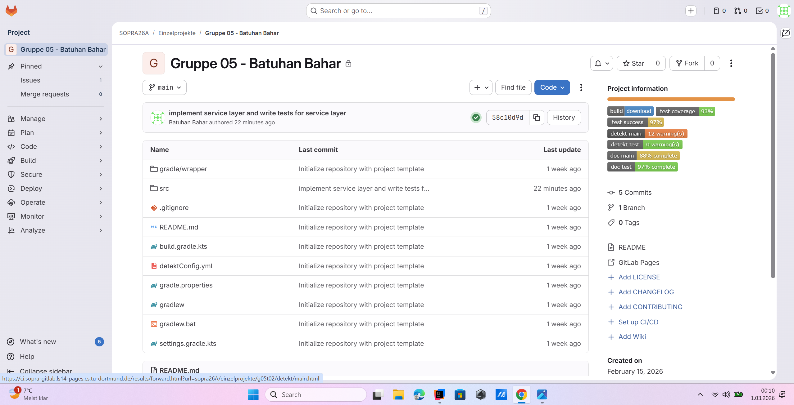
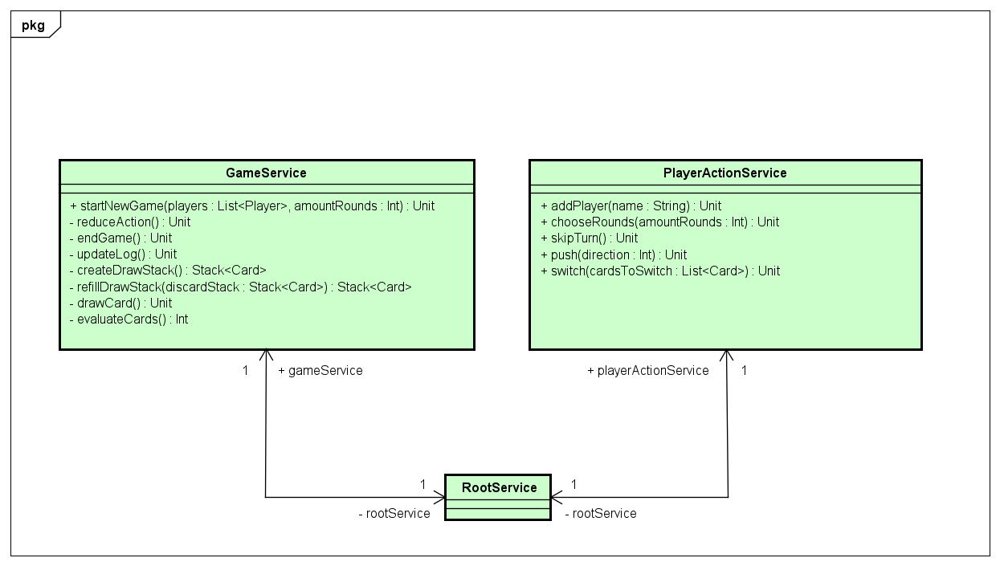
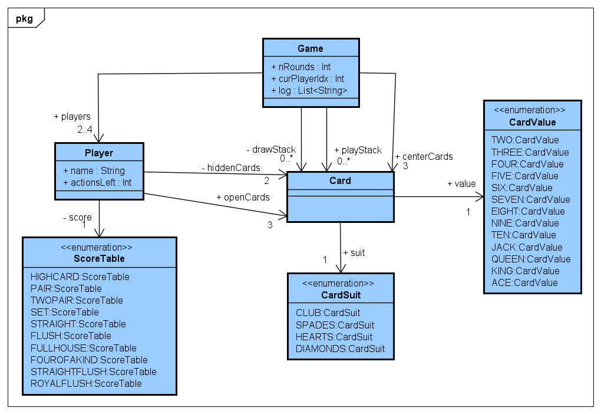
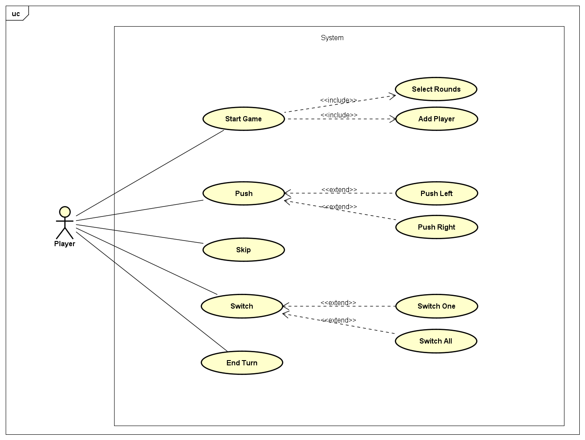
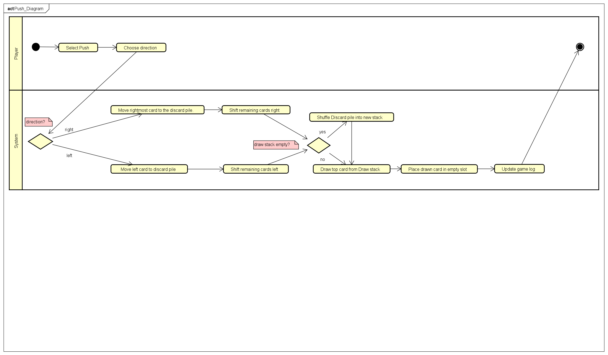
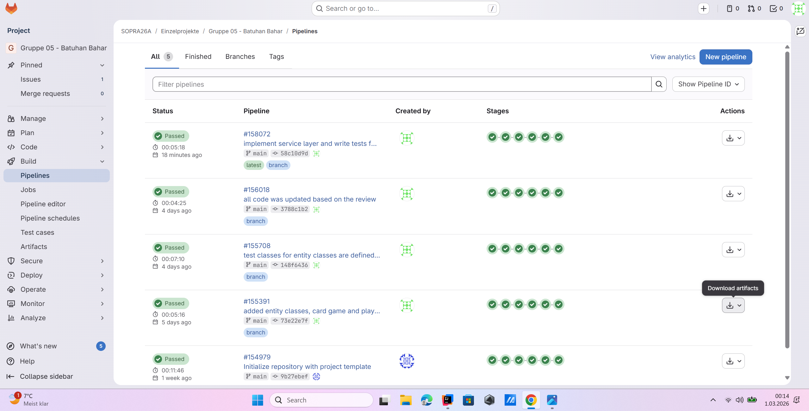
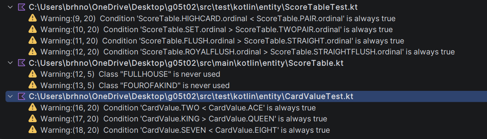

# ♥ Schiebe Poker (Push Poker) ♦

A desktop card game written in **Kotlin** with the **BoardGameWork (BGW)** framework.
It was built as the individual project (*Einzelprojekt*) of the **Software Praktikum (SoPra) 1** course at
**TU Dortmund**, summer term 2025 .

> **Course assignment.** This repository is my solution to the SoPra 1 assignment. The task was to design,
> implement and test a complete game following the course architecture (entity / service / GUI layers),
> UML modelling, unit tests and static analysis with detekt.



## The game

Push Poker is a poker variant for 2–4 players:

- Every player gets **5 cards**: **3 open** cards (visible to everyone) and **2 hidden** cards.
- **3 cards lie open in the middle** of the table.
- On their turn a player has **2 actions**. Each action is one of:
  - **Push left / right** – the card at the edge of the middle row goes to the discard pile and a new card is
    drawn at the opposite side. The remaining cards slide over.
  - **Switch one** – swap one of your open cards with one card from the middle.
  - **Switch all** – swap all 3 open cards with the 3 middle cards.
  - **Skip** – end the turn early.
- After the chosen number of rounds (2–7) every player's 5 cards are evaluated as a poker hand and the
  players are ranked: high card → pair → two pair → three of a kind → straight → flush → full house →
  four of a kind → straight flush → royal flush.
- When the draw stack runs empty, the discard pile is reshuffled into a new draw stack.

The GUI is in German ("Schiebe Poker", "Runde beenden", "Alle tauschen", …), as required by the course.

## Architecture

The project follows the layered architecture taught in the course:

| Layer | Package | Responsibility |
|-------|---------|----------------|
| Entity | `entity` | Game state: `Game`, `Player`, `Card`, `CardSuit`, `CardValue`, `ScoreTable` |
| Service | `service` | Game rules: `GameService`, `PlayerActionService`, tied together by `RootService` |
| GUI | `gui` | BGW scenes: menu, game table, "next player" screen, final ranking |

The service layer never touches the GUI directly. Instead, it notifies registered `Refreshable` objects
(observer pattern via `AbstractRefreshingService.onAllRefreshables`), and the GUI scenes update themselves.



*Service layer of the final design. The first, broader design draft including the GUI package is in
[`docs/diagrams/Class_Diagram0.png`](docs/diagrams/Class_Diagram0.png) – some method signatures changed
during implementation.*

### Entity model



### Use cases



### Example flow: pushing the middle cards



More activity diagrams (add player, start game, switch, skip, end turn, end game) are in
[`docs/diagrams`](docs/diagrams). The API documentation is in
[`docs/api_dokumentation.pdf`](docs/api_dokumentation.pdf).

## Testing and code quality

- **70 unit tests** (JUnit 5 via `kotlin-test`) cover the entity classes and all service methods, including the
  error cases (`check` / `require` with `IllegalStateException` / `IllegalArgumentException`).
- The course GitLab CI pipeline ran detekt, tests, coverage and documentation checks on every push. At the time of
  the last pipeline run the badges showed about **93 % test coverage**, **97 % test success** and
  **88 % / 97 %** documentation coverage (main / test).





*detekt feedback during development. Most findings were tautological assertions in enum-order tests.*

## Build and run

Requirements: **JDK 11 or newer** (the Gradle toolchain is set to 11).

```bash
./gradlew run      # start the game
./gradlew test     # run the unit tests
./gradlew detekt   # static code analysis
```

> **Note:** `settings.gradle.kts` resolves the course's `edu.udo.cs.sopra` Gradle plugin and its internal packages
> from the TU Dortmund GitLab package registry, so a full build only works with course access
> (the Gradle property `sopra-gitlab.package-registry.token`). The source code itself is plain Kotlin + BGW 0.10.

## Project layout

```
src/main/kotlin
├── Main.kt                 entry point
├── entity/                 Game, Player, Card, CardSuit, CardValue, ScoreTable
├── service/                GameService, PlayerActionService, RootService, Refreshable
└── gui/                    GameApplication and the menu / game / next-player / finished scenes
src/test/kotlin             unit tests for entity and service layers
docs/                       UML diagrams, screenshots, API documentation
```

## Author

Batuhan Bahar – SoPra 1 individual project, TU Dortmund.
